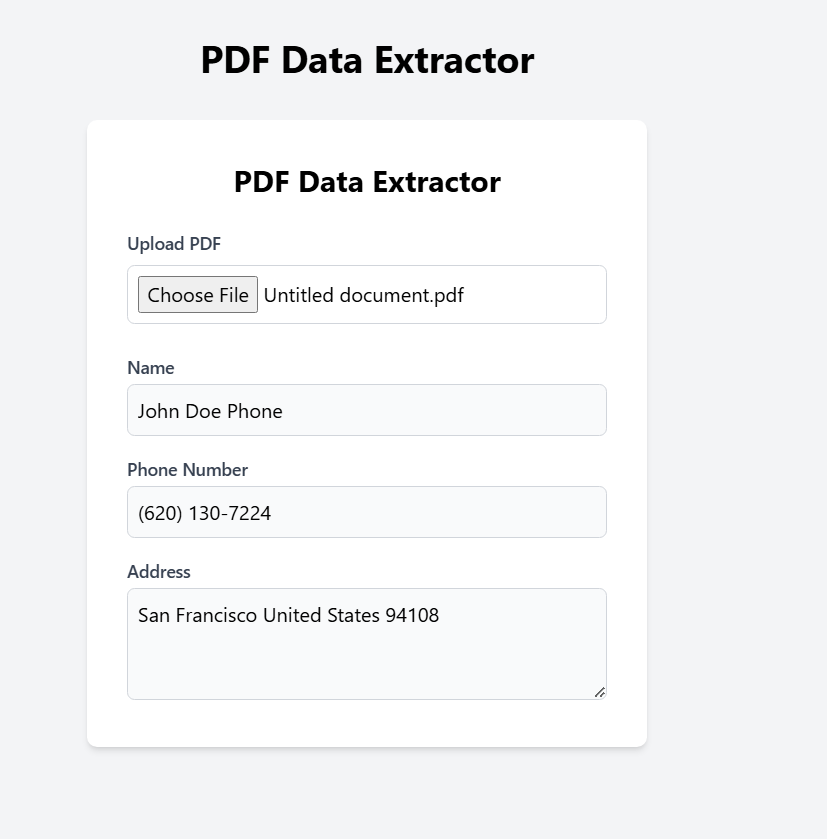

# PDF Data Extractor

Extract personal information from PDF documents automatically. Upload PDFs and get structured data like names, phone numbers, and addresses.

## Features
- PDF file upload and processing
- Automatic extraction of personal information
- Real-time data display
- Input validation and error handling



## Prerequisites
- Node.js v14+
- npm v6+

## Installation

### Backend Setup
```bash
cd pdf-extractor-backend
pip install -r requirements.txt
python -m spacy download en_core_web_sm
```

### Frontend Setup
```bash
cd pdf-extractor
npm install
```

## Running the Application

### Start frontend Server
```bash
cd pdf-extractor
npm start
# Or for development with auto-reload:
npm run dev
```
Server runs on http://localhost:3001

### Start backend Application
```bash
cd pdf-extractor-backend
python app.py
```
Application runs on http://localhost:3000

## Tech Stack
- Frontend: React, Chakra UI, Axios
- Backend: Node.js, Express
- PDF Processing: pdf-parse
- NLP: natural


## Project Structure
```
project-root/
├── frontend/
│   ├── src/
│   │   ├── components/
│   │   ├── styles/
│   │   └── App.jsx
│   └── package.json
├── backend/
│   ├── requirement.txt
│   ├── app.py
│  
└── README.md
```

## API Endpoints
- POST `/extract`: Upload PDF and extract data
  - Input: PDF file (multipart/form-data)
  - Output: JSON with extracted information

## Error Handling
- Frontend displays toast notifications for errors
- Backend provides detailed error messages
- File validation for PDF format

## Contributing
1. Fork the repository
2. Create feature branch
3. Commit changes
4. Push to branch
5. Create Pull Request

## License
ISC